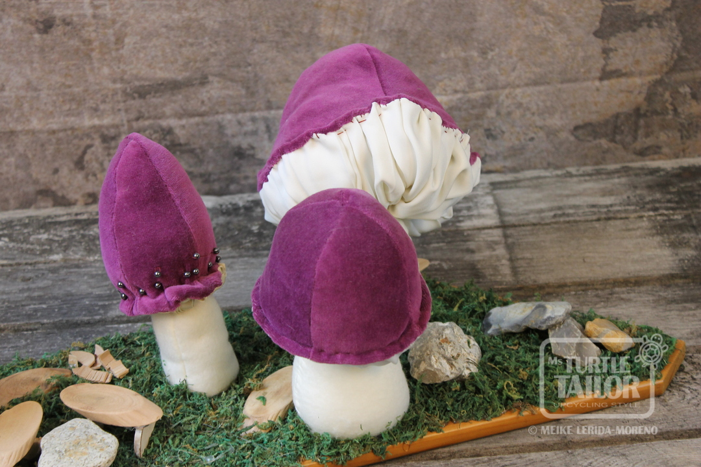

---

title: Handarbeit N°003 - Herbstdeko "Feen-Sitzecke"

layout: post

post-image: "/assets/images/2024-02-08-handarbeit-003-00.jpg"

description:

shoplink: 

buttontext: Gefalle ich Dir?

sold: "3"

soldbuttontext: Sold!

tags:
- blog
- handarbeiten
- deko
- herbstdeko

---

Ein Pilzarrangement mit Stühlen und Tischchen zum entspanntem "Chillen & Grillen" für unsere Fee'n...  
Aufgebracht auf einer Bodenplatte aus Kiefer, verziert mit echtem Moos und Naturstein.

**Maße: &emsp; &emsp; 70x20x16**

**Material: &emsp; Samt, Satin, Molton, Holz, Moos, Natursteine**

 

 

